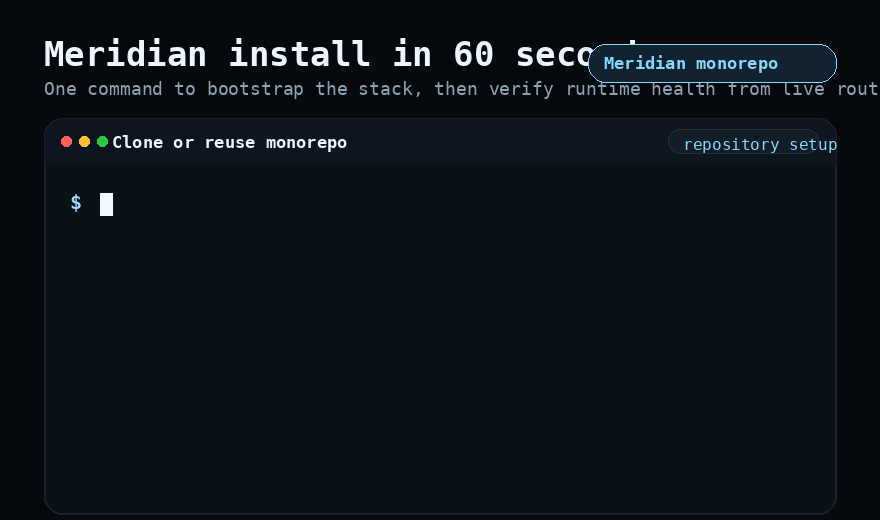
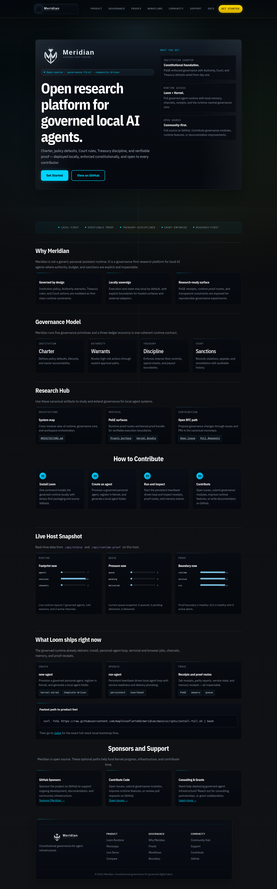
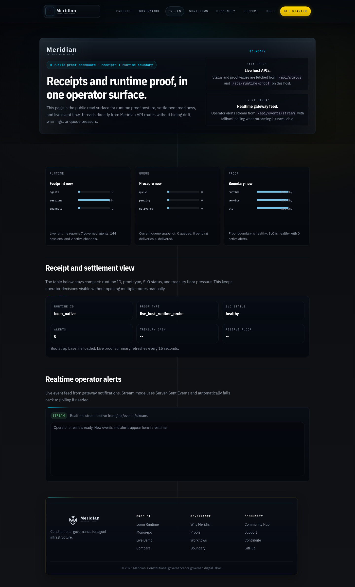
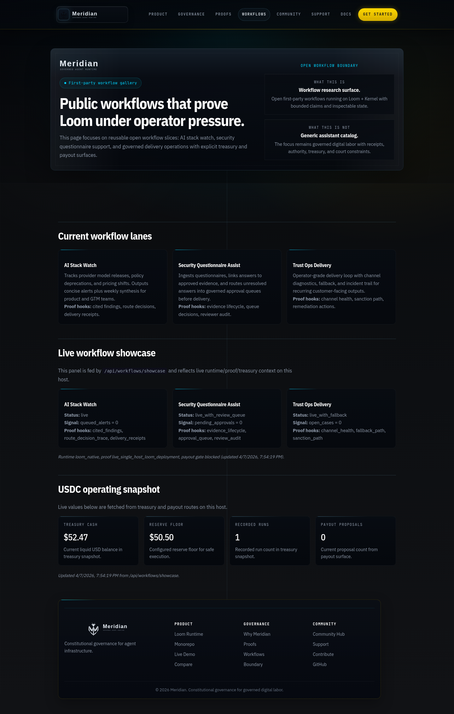

# Meridian

<p align="center">
  
</p>

<p align="center">
  <strong>Meridian — Run AI agents locally with built-in governance and verifiable proof.</strong><br>
  Install Loom. Run guided onboarding. Start your local stack. Every action gets a receipt.
</p>

<p align="center">
  
  
  
  
  
  
</p>

<p align="center">
  <a href="https://app.welliam.codes">Website</a> ·
  <a href="https://app.welliam.codes/loom">Loom</a> ·
  <a href="https://app.welliam.codes/pilot">Get Started</a> ·
  <a href="https://app.welliam.codes/compare">Compare</a> ·
  <a href="CONTRIBUTING.md">Contributing</a> ·
  <a href="ROADMAP.md">Roadmap</a>
</p>

## What You Get

**Meridian Core** is the daily-use local agent runtime: browser tasks, research, memory, scheduled automation, and agent loops — all with verifiable proof receipts on your machine. **Meridian Team** adds the full governed multi-agent layer.

Install in one command:

```bash
curl -fsSL https://raw.githubusercontent.com/mapleleaflatte03/meridian/main/scripts/install-full.sh | bash
```

Set up Core in one step:

```bash
cd ~/meridian
./scripts/onboard.sh --mode core
```

Then run daily tasks immediately:

```bash
./scripts/core.sh browse https://example.com
./scripts/core.sh research "echo hello world"
./scripts/core.sh remember my_note "something useful"
./scripts/core.sh recall my_note
./scripts/core.sh inspect
```

## Why Loom

Other local agent runtimes give you autonomy. Loom gives you autonomy plus:

- **Verifiable receipts** — every agent action produces a PoGE proof receipt you can inspect.
- **Budget controls** — Treasury enforces reserve floors, spend limits, and payout boundaries.
- **Authority gates** — high-risk actions require explicit warrants and approval paths.
- **Court rules** — violations, sanctions, appeals, and remediation are tracked with auditable history.
- **Local-first** — execution and state stay on your machine. No cloud dependency.

## Architecture

```
Meridian (platform)
├── loom/        — Local agent runtime: sessions, channels, memory, skills, proof (Rust)
├── kernel/      — Governance engine: Institution, Authority, Treasury, Court (Python)
└── intelligence/ — Interface layer: dashboards, proofs, workflows, operator tooling (Python)
```

- `loom/` is what runs your agents.
- `kernel/` is what keeps them accountable.
- `intelligence/` is what makes governance visible.

## Quick Start

After install, run the guided onboarding:

```bash
# Create your institution and first agent (interactive)
./scripts/onboard.sh
```

For non-interactive / CI usage:

```bash
MERIDIAN_INST_NAME="My Org" MERIDIAN_AGENT_NAME="Assistant" ./scripts/onboard.sh --non-interactive
```

After onboarding completes, explore the public proof surfaces:

- [Proofs](https://app.welliam.codes/proofs) — runtime proof posture dashboard
- [Workflows](https://app.welliam.codes/workflows) — operator workflow gallery
- [Demo](https://app.welliam.codes/demo) — full walkthrough

Ready-to-run gate: [`docs/ONBOARDING_CONTRACT.md`](docs/ONBOARDING_CONTRACT.md)

## Quick Visuals

Install flow:



Live surfaces:





## Dev and Maintenance Commands

These are developer/maintenance commands. **First-time users: start with `./scripts/onboard.sh` above, not these.**

```bash
# Start/stop local workspace + gateway (run after onboarding)
./scripts/dev-up.sh
./scripts/dev-down.sh

# Supervisor (auto-restart 18901/19001/8266)
./scripts/dev-supervisor.sh status

# Install only (without auto-start stack)
MERIDIAN_AUTO_START_STACK=0 ./scripts/bootstrap_full.sh

# Loom tests
cargo test --manifest-path loom/Cargo.toml --workspace

# Kernel tests
cd kernel && python3 -m unittest discover -s kernel/tests -p 'test_*.py'

# Intelligence tests
cd intelligence && python3 -m unittest -v test_gateway_brain_router.py
```

## Governance and Trust

Loom's built-in governance is what makes it different from other agent runtimes. Under the hood:

- **Kernel** provides five governance primitives (Institution, Agent, Authority, Treasury, Court) and a 3-ledger economy (REP, AUTH, CASH).
- **PoGE receipts** give you verifiable proof of every execution boundary.
- **Runtime proof routes** expose governance state through inspectable APIs.

For deep governance documentation:
- [Why Meridian](https://app.welliam.codes/why) — architecture rationale
- [Proofs](https://app.welliam.codes/proofs) — live proof posture dashboard
- [Workflows](https://app.welliam.codes/workflows) — operator workflow gallery
- [Research Hub](docs/RESEARCH_HUB.md) — RFCs, benchmarks, case studies

## Non-Goals (Locked)

- No paywall gate for core runtime/governance usage
- No mandatory commercial checkout path in onboarding
- No closed-source governance module hidden from community review

## Licenses

- Monorepo root: MIT ([`LICENSE`](LICENSE))
- `kernel/`: Apache-2.0 ([`kernel/LICENSE`](kernel/LICENSE))
- `loom/` and `intelligence/`: MIT

Canonical source is this monorepo. Legacy repos (`meridian-loom`, `meridian-kernel`, `meridian-intelligence`) are archived mirrors. See [`docs/REPO_MIGRATION_MAP.md`](docs/REPO_MIGRATION_MAP.md).

## Contribute

- [`CONTRIBUTING.md`](CONTRIBUTING.md)
- [Issue templates](.github/ISSUE_TEMPLATE)
- [Roadmap](ROADMAP.md)
- [Community map](docs/COMMUNITY_MAP.md)

Optional support: [GitHub Sponsors](https://github.com/sponsors/mapleleaflatte03) · [Sustainability policy](docs/SUSTAINABILITY.md)

---

*Meridian positioning contract: [`docs/MESSAGE_CONTRACT.md`](docs/MESSAGE_CONTRACT.md)*
